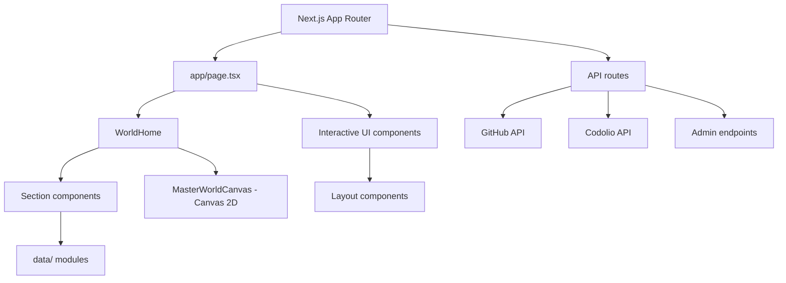

# Karkala Shiva Reddy — Portfolio

This repository contains my personal portfolio as a Next.js application. It is designed as a small software product rather than a static résumé: projects, engineering interests, coding profiles, and contact links are presented through an interactive, responsive interface with a Canvas 2D world scene, command palette, and admin system.

Live site configured for this repository: [portfolio-shiva-c677.vercel.app](https://portfolio-shiva-c677.vercel.app)

## Features

- App Router landing page composed from hero, signal, work, systems, GitHub, journey, learning, and contact sections.
- Project data model with problem, solution, architecture, technology, category, and repository fields.
- Interactive navigation, scroll progress, reveal/text animations, and a command palette.
- Canvas 2D world scene (`MasterWorldCanvas`) — a scroll-driven, palette-shifting visualization with projected nodes, signal streams, architecture diagrams, and skill maps, rendered entirely with `getContext("2d")`.
- Admin panel with HMAC-signed stateless sessions, GitHub and Codolio data sync, and readme publishing.
- Links to GitHub, LinkedIn, email, and Codolio profiles.

Content lives in typed data modules under `data/`; no runtime CMS is used.

## Architecture



## Stack

| Area | Technologies |
| --- | --- |
| Application | Next.js 16.3.4, React 19.2.8, TypeScript |
| Styling | Tailwind CSS 4, custom CSS design system |
| Icons | Lucide React |
| Scene | Canvas 2D (`MasterWorldCanvas.tsx` using `getContext("2d")`) |
| Animations | CSS transitions, CSS `scroll-timeline`, IntersectionObserver, `requestAnimationFrame` |
| Quality | ESLint, TypeScript, Next production build |

## Run locally

Prerequisites: Node.js 20+ and npm.

```bash
git clone https://github.com/karkalashivareddy/portfolio.git
cd portfolio
npm install
npm run dev
```

Open `http://localhost:3000`.

Available scripts:

```bash
npm run dev       # development server
npm run build     # production build
npm start         # serve the production build
npm run lint      # ESLint
```

No environment variables are required by the current source tree. If deployment-specific configuration is added later, document it here and keep real credentials out of the repository.

## Project structure

```text
app/
  page.tsx              landing page (WorldHome)
  layout.tsx            metadata, fonts, theme bootstrap
  globals.css           global visual system
  projects/             projects index + [slug] case study
  coding/               coding profile page
  github/               GitHub overview page
  about/                about page
  contact/              contact page
  journey/              journey timeline page
  learning/             learning roadmap page
  systems/              systems page
  visual-lab/           visual lab page
  admin/                admin panel (settings, analytics)
  api/                  API route handlers
components/
  hero/                 Hero, HeroReveal, EngineerGraph
  home/                 FeaturedProjects, ProofStrip, Capabilities, ContactBlock, etc.
  layout/               Nav, Footer, Container, CommandPalette, ScrollProgress, etc.
  projects/             ProjectCard, ProjectDetail, CaseStudy*, FlowDiagram
  coding/               CodingOverview, RatingChart, CodingGoals, etc.
  github/               GitHubRepos, GitHubArchive
  admin/                AdminGate, AdminLogin, AdminPanel, AnalyticsPanel, SettingsPanel
  ui/                   Button, Pill, SectionHeader, StatBlock, Reveal, etc.
  world/                MasterWorldCanvas, WorldHome
  visual-lab/           VisualLab
data/                   profile, projects, skills, coding, timeline, caseStudies, etc.
hooks/                  useCountUp, useInView
lib/                    utilities (config, types, security, github, codolio, analytics, etc.)
```

## Engineering notes

- `MasterWorldCanvas` is a client-only Canvas 2D component that renders a scroll-reactive world scene with projected nodes, signal streams, architecture diagrams, skill maps, and a constellation view — all via `getContext("2d")` and `requestAnimationFrame`, with no WebGL dependency.
- Project metadata is typed through the `Project` interface, keeping portfolio content consistent across sections.
- Reduced-motion handling uses `window.matchMedia("(prefers-reduced-motion: reduce)")` inside components; no dedicated hook.
- The admin system uses HMAC-SHA256 signed stateless session cookies with rotation, CSRF same-origin checks, and timing-safe comparison.
- The configured Vercel URL is treated as a deployment link; deployment configuration is not stored in this repository.

## Author

**Karkala Shiva Reddy** — [GitHub](https://github.com/karkalashivareddy)
