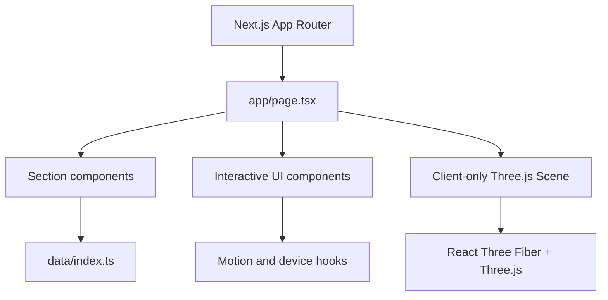

# Karkala Shiva Reddy — Portfolio

This repository contains my personal portfolio as a Next.js application. It is designed as a small software product rather than a static résumé: projects, engineering interests, coding profiles, and contact links are presented through an interactive, responsive interface with motion, a command palette, an interview-focused mode, and a client-only Three.js scene.

Live site configured for this repository: [portfolio-shiva-c677.vercel.app](https://portfolio-shiva-c677.vercel.app)

## Features

- App Router landing page composed from hero, work, about, lab, and contact sections.
- Project data model with problem, solution, architecture, technology, category, and repository fields.
- Interactive navigation, scroll progress, reveal/text animations, magnetic buttons, and a command palette.
- Interview Mode for presenting project details in a focused reading flow.
- Client-only React Three Fiber scene that avoids server-side rendering for the 3D canvas.
- Reduced-motion and mobile hooks used by the interactive UI.
- Links to GitHub, LinkedIn, email, and Codolio profiles.

The content is currently maintained in source files under `data/`; no runtime CMS or GitHub API integration is implemented.

## Architecture



## Stack

| Area | Technologies |
| --- | --- |
| Application | Next.js 16.3.4, React 19, TypeScript |
| Styling | Tailwind CSS 4, project CSS design system |
| Interaction | Framer Motion, GSAP, Lenis, Lucide React |
| 3D | Three.js, React Three Fiber, `@react-three/drei` |
| Quality | ESLint, TypeScript, Next production build |

## Run locally

Prerequisites: Node.js 20+ and npm.

```bash
git clone https://github.com/karkalashivareddy/portfolio.git
cd portfolio
npm install
npm run dev
```

Open `http://localhost:3000`.

Available scripts:

```bash
npm run dev       # development server
npm run build     # production build
npm start         # serve the production build
npm run lint      # ESLint
```

No environment variables are required by the current source tree. If deployment-specific configuration is added later, document it here and keep real credentials out of the repository.

## Project structure

```text
app/
  page.tsx              page composition
  layout.tsx            metadata and fonts
  globals.css           global visual system
components/
  sections/             hero, work, about, lab, and contact sections
  ui/                   navigation and interaction primitives
  3d/                   client-only Three.js scene
data/index.ts           profile, projects, skills, and external links
hooks/                  reduced-motion, mobile, and pointer hooks
lib/                    shared utilities
```

## Engineering notes

- `Scene` is dynamically imported with server-side rendering disabled because WebGL/canvas work belongs in the browser.
- Project metadata is typed through the `Project` interface, which keeps the portfolio content consistent across sections.
- The UI includes reduced-motion and mobile checks so the visual layer can adapt without changing the content model.
- The configured Vercel URL is treated as a deployment link; deployment configuration is not stored in this repository.

## Author

**Karkala Shiva Reddy** — [GitHub](https://github.com/karkalashivareddy)
