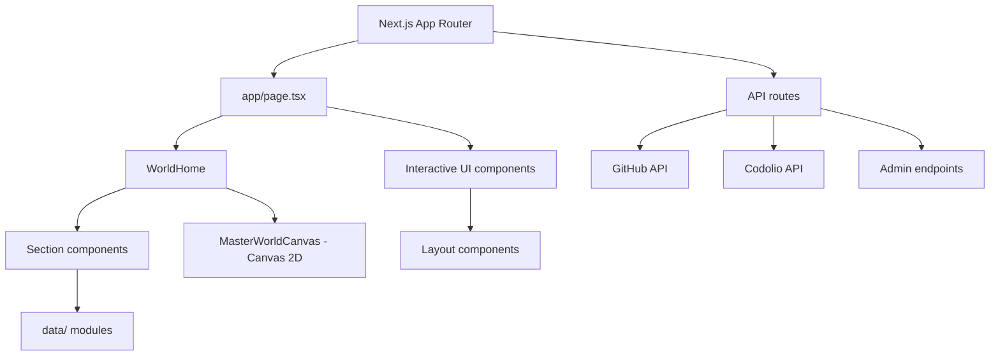

# Karkala Shiva Reddy — Portfolio

This repository contains my personal portfolio as a Next.js application. It is designed as a small software product rather than a static résumé: projects, engineering interests, coding profiles, and contact links are presented through an interactive, responsive interface with a Canvas 2D world scene, command palette, and admin system.

**Deployment status:** there is no publicly reachable deployment of this site. A Vercel project
(`portfolio-shiva-c677.vercel.app`) is registered, but a direct request on 2026-10-06 returned
`HTTP 302` to `vercel.com/sso-api`, meaning it is behind Vercel single sign-on and cannot be viewed
without an account. It is therefore not advertised as a live site. Everything below is verified by
running it locally.

## Features

- App Router landing page composed from hero, signal, work, systems, GitHub, journey, learning, and contact sections.
- Project data model with problem, solution, architecture, technology, category, and repository fields.
- Coding and GitHub figures read on the server and rendered with an explicit freshness state, including the absolute timestamp of the measurement.
- Interactive navigation, reveal/text animations, and a command palette.
- Canvas 2D world scene (`MasterWorldCanvas`) — a scroll-driven, palette-shifting visualization with projected nodes, signal streams, architecture diagrams, and skill maps, rendered entirely with `getContext("2d")`.
- Admin panel with HMAC-signed stateless sessions, GitHub and Codolio data sync, and readme publishing.
- Links to GitHub, LinkedIn, email, and Codolio profiles.

Content lives in typed data modules under `data/`; no runtime CMS is used.

## Where the numbers come from

Coding and GitHub figures are never hard-coded in components. `lib/codolio.ts` and
`lib/github.ts` each return a snapshot plus a `meta` record, and the UI states which of these
three things it is showing:

| `meta.origin` | `meta.status` | What the visitor is told |
| --- | --- | --- |
| `api` | `live` | Synchronized, read within the last minute |
| `api` | `recent` / `synced` | Synchronized, with the relative and absolute time of the read |
| `api` | `stale` / `very-stale` | Stale, with the age; values are still shown |
| `snapshot` | any | Verified snapshot, never described as synchronized |

The freshness label is always computed from a timestamp by `freshnessFor` in `lib/store.ts`,
never chosen by hand, and relative time is only rendered after hydration so the server and the
browser cannot disagree (that mismatch was a real React hydration error).

`/`, `/coding` and `/github` are `force-dynamic`: a prerendered HTML file would freeze the
freshness label at build time. The loaders cache for their TTL, so a request costs one upstream
call per TTL window rather than one per visit. When an API is unreachable and no cached copy
exists, the page degrades to the dated committed snapshot in `data/coding.ts` and
`lib/github.ts` rather than to an empty state.

## Architecture


```mermaid
flowchart TD
    R[Next.js App Router] --> P[app/page.tsx]
    P --> W[WorldHome]
    W --> S[Section components]
    W --> C[MasterWorldCanvas - Canvas 2D]
    S --> D[data/ modules]
    P --> U[Interactive UI components]
    U --> L[Layout components]
    R --> A[API routes]
    A --> GH[GitHub API]
    A --> CO[Codolio API]
    A --> AD[Admin endpoints]
```

## Stack

| Area | Technologies |
| --- | --- |
| Application | Next.js 16.3.4, React 19.2.8, TypeScript |
| Styling | Tailwind CSS 4, custom CSS design system |
| Icons | Lucide React |
| Scene | Canvas 2D (`MasterWorldCanvas.tsx` using `getContext("2d")`) |
| Animations | CSS transitions, CSS `scroll-timeline`, IntersectionObserver, `requestAnimationFrame` |
| Quality | ESLint, TypeScript, Next production build |

## Run locally

Prerequisites: Node.js 20+ and npm.

```bash
git clone https://github.com/karkalashivareddy/portfolio.git
cd portfolio
npm install
npm run dev
```

Open `http://localhost:3000`.

Available scripts:

```bash
npm run dev         # development server
npm run build       # production build
npm start           # serve the production build
npm run lint        # ESLint
npm run typecheck   # tsc --noEmit
npm run test:e2e    # Playwright suite against `next start`
npm run verify      # lint + typecheck + build + e2e
```

## Tests

`npm run test:e2e` runs Playwright against the **production build** served by `next start`, so a
green run means the deployed bundle renders. It covers navigation and the command palette, every
case study, the coding and GitHub routes, their freshness states, mobile/desktop overflow, and one
`main` landmark plus one `h1` per route.

The data-driven routes are server components, so their data cannot be stubbed from the browser.
The suite therefore starts the server with `PORTFOLIO_TEST_FIXTURES=1`, which makes
`lib/fixtures.ts` serve the recorded payloads in `e2e/fixtures.ts` instead of calling Codolio or
GitHub. Each test publishes the state it needs into `e2e/.state`, so the freshness labels are
exercised deterministically and the suite cannot be broken by someone else's rate limit. The seam
is inactive unless that variable is set, and a deployment must not set it.

To check the real upstream contracts instead:

```bash
E2E_LIVE=1 npm run test:e2e
```

The first run needs a browser (`npx playwright install chromium`). Locally installed Chrome is used
automatically when present; override with `CHROME_PATH`.

### Known dependency advisory

`npm audit` reports 5 high-severity findings and no critical ones. All five are the same
transitive chain — `eslint-config-next → @next/eslint-plugin-next → fast-glob → micromatch →
braces` (GHSA-vfj7-8cjw-p6xm, stack exhaustion on deeply nested glob patterns). It is a
development-only path: it is reached when ESLint loads the Next plugin, not at runtime or build
time, no patched `braces` release exists yet, and npm's suggested remedy is a major downgrade of
`eslint-config-next`. The critical `next/og` advisory (GHSA-vcvr-r3jv-pc5j) is resolved: Next is
pinned to 16.3.8, and this project does not use `ImageResponse` at all — `public/og.png` is a
static asset.

**Environment variables are optional.** The site runs with no `.env` file at all: every variable in
[`.env.example`](.env.example) has a safe default in `lib/config.ts`. Setting them turns on optional
behaviour —

| Variable | Effect when unset | Effect when set |
| --- | --- | --- |
| `GITHUB_TOKEN` | GitHub API limited to 60 requests/hour | 5,000/hour, so the sync layer does not rate-limit |
| `ADMIN_TOKEN` | `/admin` routes are disabled and return 404 | Enables the admin panel behind an HMAC-signed session |
| `GITHUB_WEBHOOK_SECRET` | `/api/webhooks/github` refuses unsigned requests | Accepts signed deliveries |
| `NEXT_PUBLIC_SITE_URL` | Canonical URL falls back to a default | Sets OG/canonical links for the real host |
| `CODOLIO_TTL_MS` / `GITHUB_TTL_MS` | 60 / 15 minutes | Changes how long a snapshot counts as synchronized |

Two variables exist only for the test suite and must stay unset in a deployment:
`PORTFOLIO_TEST_FIXTURES=1` activates the fixture seam in `lib/fixtures.ts`, and
`PORTFOLIO_FIXTURE_DIR` chooses where those fixtures are read from.

`ADMIN_TOKEN` is a real gate, so it must be set to a generated value rather than left empty in any
deployment. No real credential is committed here; `.env` is ignored and `.env.example` holds placeholders.

## Project structure

```text
app/
  page.tsx              landing page (WorldHome)
  layout.tsx            metadata, fonts, theme bootstrap
  globals.css           global visual system
  projects/             projects index + [slug] case study
  coding/               coding profile page
  github/               GitHub overview page
  about/                about page
  contact/              contact page
  journey/              journey timeline page
  learning/             learning roadmap page
  systems/              systems page
  visual-lab/           visual lab page
  admin/                admin panel (settings, analytics)
  api/                  API route handlers
components/
  layout/               Nav, Footer, CommandPalette, SiteShell, WorldField
  projects/             ProjectDetail, CaseStudyStage, CaseStudyVisual, FlowDiagram
  coding/               CodingRouteLive
  github/               GitHubArchive
  admin/                AdminGate, AdminLogin, AdminPanel, AnalyticsPanel, SettingsPanel
  ui/                   Button, StatBlock, Reveal, CursorFx, BrandIcons, EmailCopyButton, SyncStatus
  world/                MasterWorldCanvas, WorldHome
  visual-lab/           VisualLab
data/                   profile, projects, skills, coding, timeline, caseStudies, etc.
hooks/                  useCountUp, useInView
lib/                    utilities (config, types, security, github, codolio, analytics,
                        store, format, fixtures, etc.)
e2e/                    Playwright suite (smoke, freshness) and recorded payloads
playwright.config.ts    suite configuration; starts `next start` on port 3210
```

## Engineering notes

- `MasterWorldCanvas` is a client-only Canvas 2D component that renders a scroll-reactive world scene with projected nodes, signal streams, architecture diagrams, skill maps, and a constellation view — all via `getContext("2d")` and `requestAnimationFrame`, with no WebGL dependency.
- Project metadata is typed through the `Project` interface, keeping portfolio content consistent across sections.
- Reduced-motion handling uses `window.matchMedia("(prefers-reduced-motion: reduce)")` inside components; no dedicated hook.
- The admin system uses HMAC-SHA256 signed stateless session cookies with rotation, CSRF same-origin checks, and timing-safe comparison. It is off unless `ADMIN_TOKEN` is set.
- A Vercel project exists for this repository but is behind single sign-on, so there is no public URL to link. Deployment configuration is not stored in this repository.

## Screenshots

| View | Screenshot |
| --- | --- |
| Home (Canvas 2D world scene) |  |
| Projects |  |
| Coding |  |
| About |  |

*Screenshots captured from live Next.js application (dev server on :3099) on 2026-09-17. The `MasterWorldCanvas` uses Canvas 2D (`getContext("2d")`), not WebGL.*

## Author

**Karkala Shiva Reddy** — [GitHub](https://github.com/karkalashivareddy)
